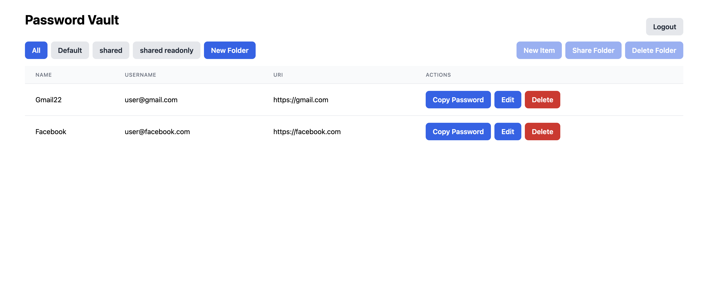

# Password Manager Example

Live version: https://passwords-demo.jazz.tools



## Installing & running the example locally

(this requires `pnpm` to be installed, see [https://pnpm.io/installation](https://pnpm.io/installation))

Start by checking out `jazz`
```bash
git clone https://github.com/gardencmp/jazz.git
cd jazz/examples/password-manager
pnpm pack --pack-destination /tmp
mkdir -p ~/jazz-examples/password-manager # or any other directory
tar -xf /tmp/jazz-example-pass-manager-* --strip-components 1 -C ~/jazz-examples/password-manager
cd ~/jazz-examples/password-manager
```

This ensures that you have the example app without git history and independent of the Jazz multi-package monorepo.

Install dependencies:

```bash
pnpm install
```

Start the dev server:

```bash
pnpm dev
```

## Structure

- [`src/components`](./src/components/): UI components
- [`src/1_schema.ts`](./src/1_schema.ts): Jazz data model
- [`src/2_main.tsx`](./src/2_main.tsx): Main App component wrapped in `<Jazz.Provider>`
- [`src/3_vault.tsx`](./src/3_vault.tsx): Password Manager Vault page
- [`src/4_actions.tsx`](./src/4_actions.tsx): Jazz specific actions
- [`src/5_App.tsx`](./src/5_App.tsx): App router - also handles invite links
- [`src/types.ts`](./src/types.ts): shared types

## Walkthrough

### Main parts

1. Define the data model with CoJSON: [`src/1_schema.ts`](./src/1_schema.ts)

2. Wrap the App with the top-level provider `<Jazz.Provider>`: [`src/2_main.tsx`](./src/2_main.tsx)

3. Reactively render password items from folders inside a table, creating/sharing/deleting folders, creating/editing/deleting password items: [`src/3_vault.tsx`](./src/3_vault.tsx)

4. Implement Jazz specific actions: [`src/4_actions.tsx`](./src/4_actions.tsx)

5. Implement useAcceptInvite(): [`src/5_App.tsx`](./src/5_App.tsx)

## Questions / problems / feedback

If you have feedback, let us know on [Discord](https://discord.gg/utDMjHYg42) or open an issue or PR to fix something that seems wrong.

## Configuration: sync server

By default, the example app uses [Jazz Global Mesh](https://jazz.tools/mesh) (`wss://sync.jazz.tools`) - so cross-device use, invites and collaboration should just work.

You can also run a local sync server by running `npx cojson-simple-sync` and adding the query param `?sync=ws://localhost:4200` to the URL of the example app (for example: `http://localhost:5173/?peer=ws://localhost:4200`), or by setting the `sync` parameter of the `<Jazz.Provider>` provider component in [./src/2_main.tsx](./src/2_main.tsx).
